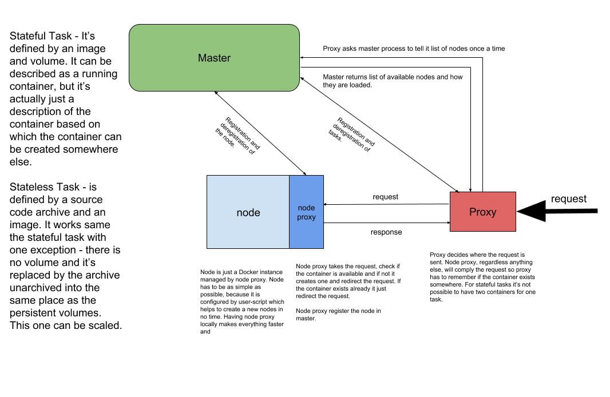

# ShadowProject

This project makes easier to run a single application in cloud.

It's under development, but getting better every day. Right now even the
API and data structure are not completed so don't use this in production.

If you want to test it, clone the source and call:

    make
    
You will need minio server running. Check the part of this README about testing.

Then run *master* process, no configuration is needed. When it's done run nodeproxy:

    S3_ACCESS_KEY=THE_ACCESS_KEY
    S3_SECRET_KEY=THE_SECRET_KEY

I will prepare quickstart guide and documentation as soon as the minimal
viable product is done.

If you want to help me, let me know here: cx@initd.cz

## Problem

It's expensive to run Python, Go or Node.js applications, because you need
your own server and that means a lot of time to maitaining it or money to pay
somebody to do that for you. This project wants to make this easy and cheap.
Your application doesn't need the server all the time but only in moments
the requests is coming. Any other moment the app can be turned off. That
means you won't pay $10 per app each month but for example $1 per app for
same time. The price depends on the storage and time the
application is running. For many use cases it will be always cheaper than
the standard hosting or VPS.

The technology behind this is in DigitalOcean's and AWS's block storage
services (EBS in AWS). This tools holds your data in this reliable storage
and this tools mounts it only in case the request comes. When the app is not used
everything related, except the data, is removed and possibly the
underlaying server too. That means the most of the time you pay for
storage but not for servers.  

## Architecture

Every application is handled internally as a task. The request goes to main proxy
where it's redirected to a node proxy. Node proxy cares only about local
containers and it fires the container for the coming request regardless
anything else (if the same container exists on a different node). The proxy server
remembers where the request was redirected and another request will be
sent to the same node. Node decides what containers to kill and what to let run.

The architecture is not finished yet and a lot of things can change.

### Micro services and their status

**master**

This is just a basic API to synchronize actions between nodeproxy and proxy.
Nodeproxy reads info about tasks here.

**nodeproxy**

Node proxies takes requests from the *proxy* and tries to handle it. Fires up
new container if it's needed or it will use existing one and sends the request
on its port 8000. Then waits for the response and returns it back.

Except debugging this is almost done and it can be used for testing. The 
debugging part has to be implemented in master process. Not sure how in this moment.

**proxy**

I haven't started yet on this one because it's tricky. It has
to monitor all available nodes, decide where to send new requests, fire
up new servers and kick down the old ones. Same time is has to independend
from other proxies. I am thinking about letting this independent. Each
proxy has it's own set of workers and all proxies are in on level.

Same time I want to limit communication between all three miro services
to keep the cloud as self-healable as possible. So there are no deregistration
requests between nodeproxy and proxy, but if some container is not used anymore
node proxy will kill it after a few minutes without any request. Also proxy
should test health of its node proxies, remove the broken ones and fire up
new ones.

## Longterm TODO:

* Support for stateful tasks
* ~~Support for stateless tasks - no permanent storage~~
* Autoscaling for stateless tasks based on CPU load
* Accounting
* Debugging - logging, possibly SSH access to the container

## The tests

S3 is not properly mocked so to run the test, fire up a minio server:

    export MINIO_ACCESS_KEY=3D2U2V66A3CP0CB088Z3
    export MINIO_SECRET_KEY=Uipi4szPTGhyjoTFsmtXJrIf9cbqnfLRPQH6e8Ho
    minio server /tmp/minio/
    